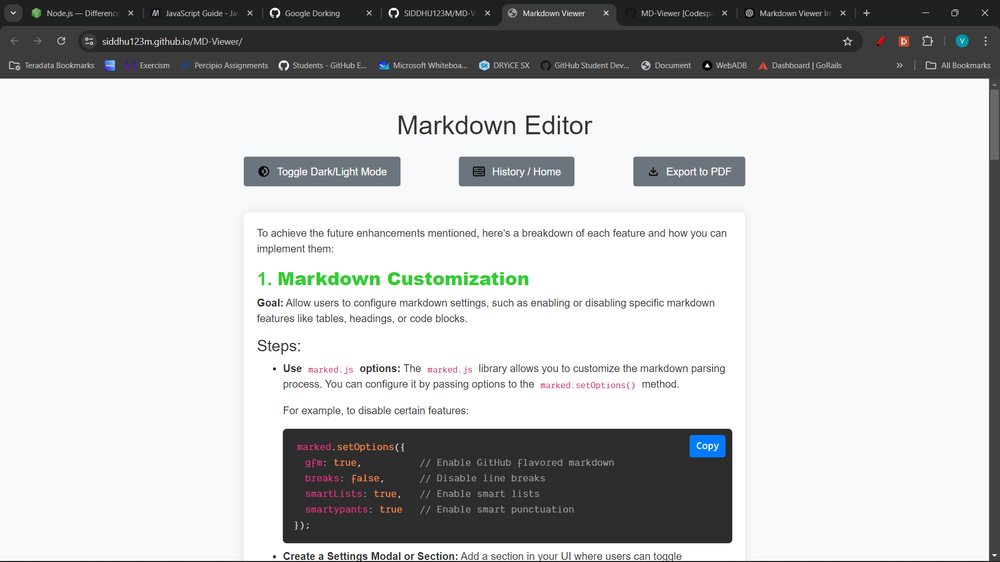
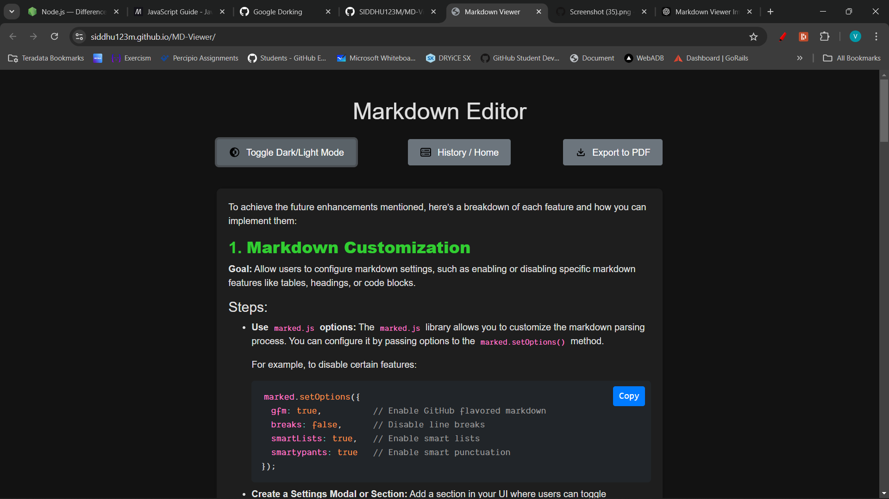

# Markdown Viewer [CLICK-ME](https://siddhu123m.github.io/MD-Viewer/)

A modern and responsive Markdown Viewer that allows users to input, preview, export, and manage markdown text with features like dark mode, history management, and code block copying. This project is designed to be user-friendly with an intuitive UI that adapts to both light and dark themes, offering a seamless markdown editing and exporting experience.

## Features

- **Markdown Parsing**: Converts markdown syntax into HTML using `marked.js`, supporting all basic markdown elements.
- **Responsive Design**: Fully responsive layout that works on desktop and mobile devices with a modern UI.
- **Light/Dark Mode Toggle**: Users can switch between light and dark modes with smooth color transitions.
- **History Management**: Saves input history in local storage with options to view, edit, or delete previous markdown entries.
- **Code Block Copying**: Adds "Copy" buttons to code blocks, allowing users to easily copy code snippets.
- **Live Preview**: Real-time rendering of markdown input with styled headings, links, code, and more.
- **Export to PDF**: Export the rendered markdown content as a PDF for easy sharing and saving.

## Demo

### Light Mode


### Dark Mode


## Installation

1. **Clone the repository**:
   ```bash
   git clone https://github.com/your-username/markdown-viewer.git
   ```
   
2. **Navigate to the project directory**:
   ```bash
   cd markdown-viewer
   ```

3. **Open the `index.html` file in a browser**:
   Simply open the `index.html` file locally in your preferred web browser.

## Usage

1. **Enter Markdown**:
   - Use the textarea to input your markdown text.
   - Click the "Submit" button to render the markdown.

2. **Toggle Dark/Light Mode**:
   - Click the "Toggle Dark/Light Mode" button to switch between light and dark themes.

3. **History Management**:
   - Click the "History / Home" button to view your previously entered markdown.
   - You can view, edit, or delete any of the markdown entries saved in local storage.
   - Clear all history using the "Clear All History" button.

4. **Export to PDF**:
   - After rendering your markdown, click the "Export to PDF" button to download the content as a PDF file.

5. **Copy Code Blocks**:
   - Code blocks will have a "Copy" button on the top-right corner. Click the button to copy the code to the clipboard.

## Technologies Used

- **HTML5**: Structure of the webpage.
- **CSS3**: Styling and responsive layout.
- **JavaScript**: Markdown parsing, exporting PDF, and functionality for toggling themes, handling history, and managing local storage.
- **Marked.js**: A markdown parser that converts markdown into HTML.
- **No External Libraries**: The project avoids using any external frameworks like Bootstrap to ensure it’s fully customizable.

## Future Enhancements

- **Add Markdown Customization**: Implement the ability to configure markdown settings (e.g., enabling/disabling certain markdown features).
- **Cloud Sync**: Sync markdown history to the cloud for accessibility across multiple devices.
- **Custom Themes**: Allow users to choose custom themes or define their own color palettes for light and dark modes.

## License

This project is licensed under the MIT License. You are free to use, modify, and distribute the code as long as proper credit is given.

## Contributing

Feel free to open an issue or submit a pull request if you find any bugs or would like to contribute to the project.

## Contact

For any questions or feedback, please contact [sidharth69aio@gmail.com](mailto:sidharth69aio@gmail.com).
